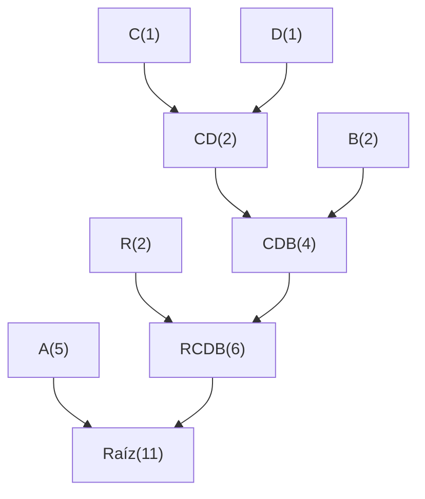

# 🗜️ Compresor de Texto con Codificación de Huffman (Greedy)

Este proyecto implementa un **compresor y descompresor de archivos de texto** utilizando el **algoritmo de Huffman**, un clásico ejemplo de **algoritmo Greedy**.  
El objetivo es reducir el tamaño de los archivos de texto asignando códigos binarios más cortos a los caracteres más frecuentes.

---

## 🚀 Características

- 📄 Entrada real desde un archivo `.txt`  
- 🧠 Implementación paso a paso del algoritmo de **Huffman (Greedy)**  
- 💻 Interfaz gráfica simple con **Tkinter**  
- 🔁 Funciones de **compresión** y **descompresión**  
- 🧩 Código modular y fácil de entender  

---

## 🧠 Cómo funciona el algoritmo Greedy

El algoritmo de Huffman es **Greedy (voraz)** porque en cada paso elige **los dos nodos con menor frecuencia** para combinarlos en uno nuevo.  
Este proceso se repite hasta obtener un solo árbol, minimizando la longitud promedio del código binario.

### Ejemplo gráfico del proceso



## ⚙️ Instalación y ejecución

### Crear entorno virtual (opcional)

```bash
python -m venv .venv
source .venv/bin/activate   # Linux / Mac
# o en Windows:
# .venv\Scripts\activate
```
### Crear entorno virtual (opcional)
```bash
python main.py
```
